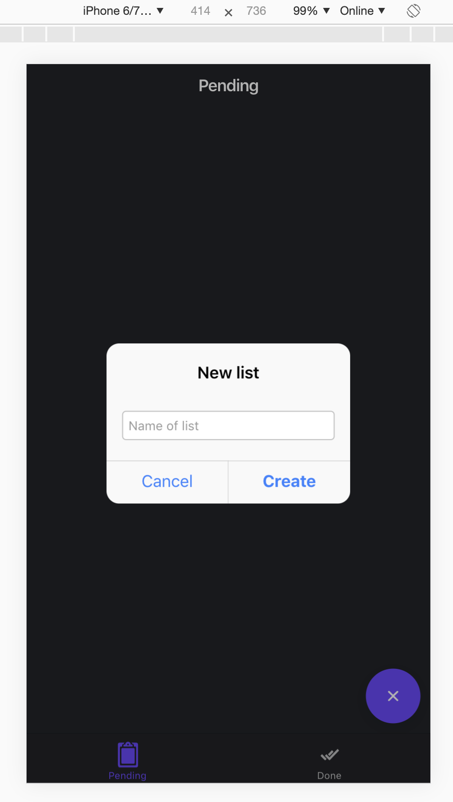
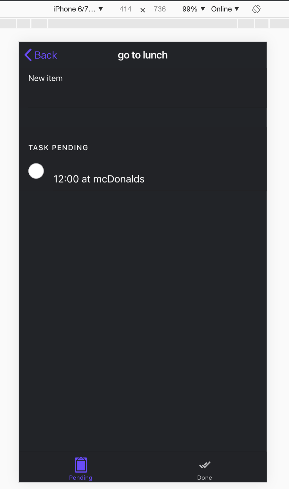
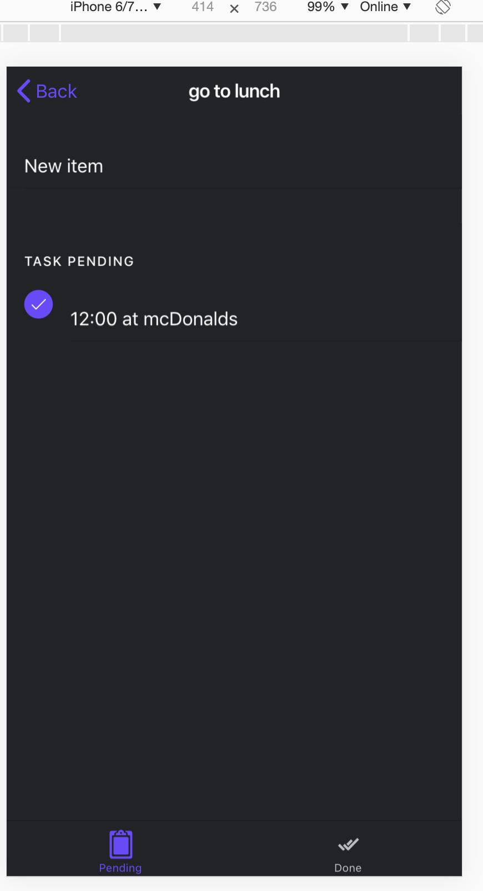
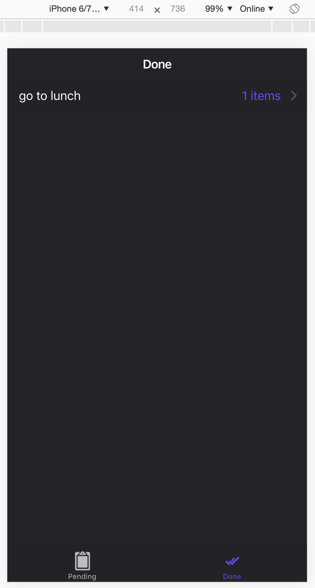
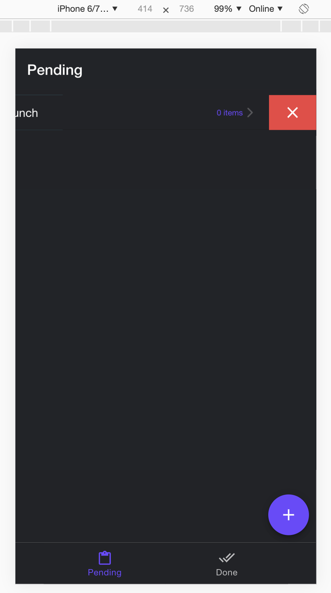
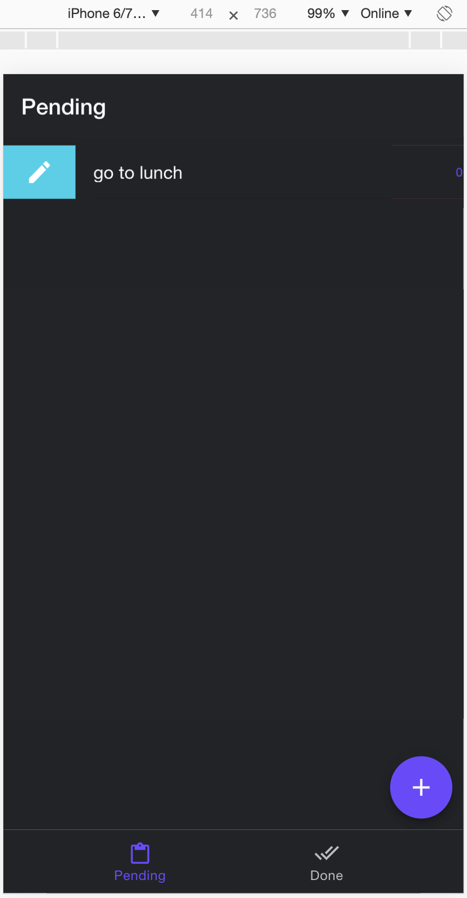

# Ionic_List
##Platform IOS

> This is `KanbanApp`, show you how apply differents kinds of elements and components, about *IONIC*.

> For Example : **services**, **ion-router-outlet**, **ion-list**, **ion-item-sliding**, etc...

> **Pending Page** :    
> 1. Create List  

> 2. Create Item List   

> 3. Check Done Item List   

> **Done Page** :    
> 4. Done Item List  

> **Edit Delete List** :    

